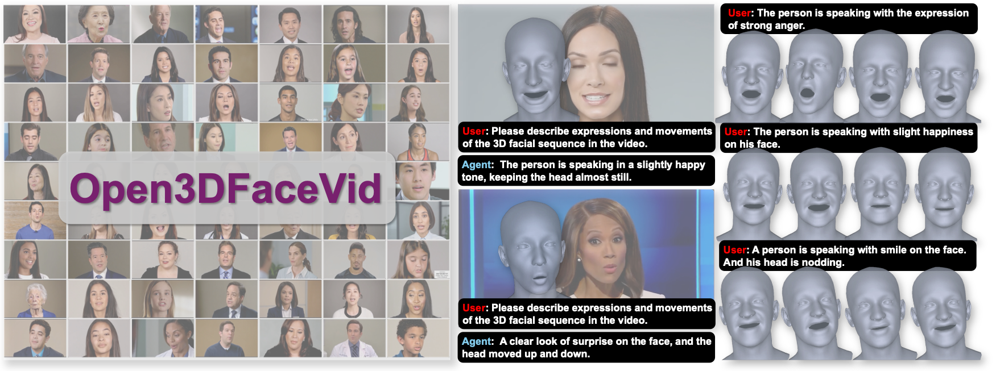

# ✨ TDMM-LM: Bridging Facial Understanding and Animation via Language Models
[**🌐 Homepage**](https://songluchuan.github.io/TDMM-LM/) | [**🔬 Paper**](https://arxiv.org/abs/2603.16936) | [**👩‍💻 Code**](https://github.com/Songluchuan/TDMM-LM_data)

## TDMM-LM Dataset
> TDMM-LM Dataset is a large-scale facial animation dataset synthesized with foundation generative models, comprising roughly 80 hours of face-centric video that spans a wide spectrum of emotions,  expressions, and head motions, with each clip paired with its text prompt and 3D facial parameters for training text-driven facial animation/understanding models.




Our dataset enables researchers and practitioners to uncover the strengths, limitations, and potential areas for improvement in text-driven facial animation/understaning models, offering valuable insights into the challenges of generating expressive and emotionally faithful facial behavior.


## 📊 Video Dataset/Annotation

<!--  -->

[Link](https://yunlong10.github.io/MMPerspective/#leaderboard)

## 🔧 Tools

We recommend using Smirk or other related facial tracking methdods to obtain the parameters.

## Data Curation Pipeline


## 👀 Visualization Results


## ✏️ Citation
```bibtex
@article{tang2025mmperspective,
  title = {MMPerspective: Do MLLMs Understand Perspective? A Comprehensive Benchmark for Perspective Perception, Reasoning, and Robustness},
  author = {Tang, Yunlong and Liu, Pinxin and Feng, Mingqian and Tan, Zhangyun and Mao, Rui and Huang, Chao and Bi, Jing and Xiao, Yunzhong and Liang, Susan and Hua, Hang and Vosoughi, Ali and Song, Luchuan and Zhang, Zeliang and Xu, Chenliang},
  journal = {arXiv preprint arXiv:2505.20426},
  year = {2025}
}
```
